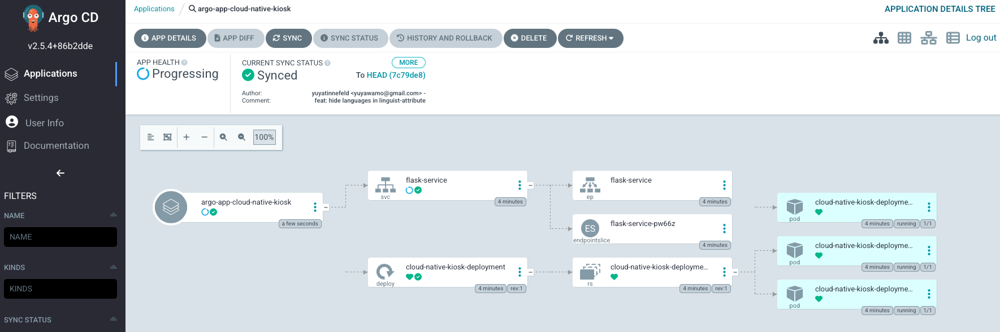

# ArgoCD


## Setup

```
# deploy ArgoCD
./start_argocd.sh

# access ArgoCD UI
export NAME_SPACE="argocd"
kubectl get service -n $NAME_SPACE
export SERVICE_NAME="argocd-server"
kubectl port-forward service/$SERVICE_NAME -n $NAME_SPACE 8080:443
```

### get argocd password (username = admin)
```bash
kubectl -n $NAME_SPACE get secret argocd-initial-admin-secret -o jsonpath="{.data.password}" | base64 -d; echo
```

### track your git repo
```bash
kubectl apply -f argocd.yaml
```

## Info
- https://argo-cd.readthedocs.io/en/stable/getting_started/